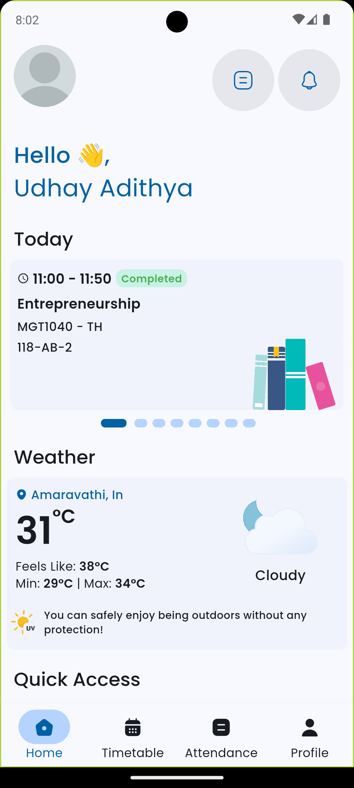
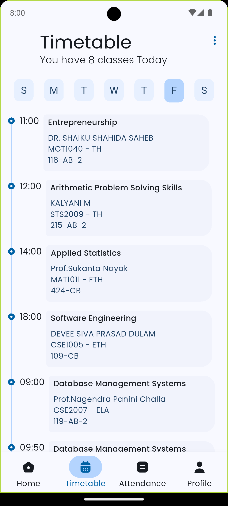
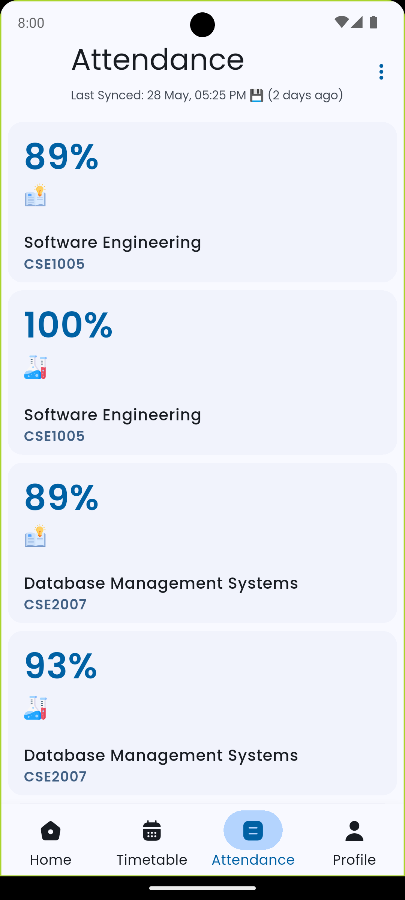
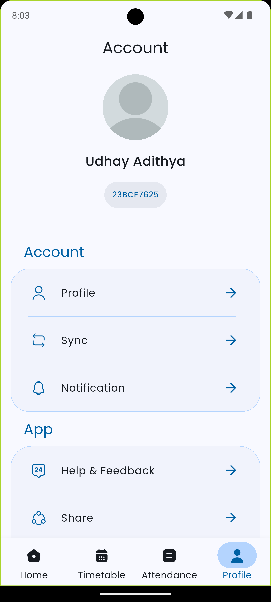

<br />
<p align="center">
     
     
</p>


##

<br>

<p align="center">
    <a href="https://github.com/Udhay-Adithya/vit_ap_student_app">
    
    </a>
    <a href="https://opensource.org/licenses/MIT">
    
    </a>
    
    <a href="https://github.com/Udhay-Adithya/vit_ap_student_app/issues">
    
    </a>
    <h1 align="center">VITAP Student</h1>
    <p align="center">The VITAP Student App is a comprehensive mobile application designed to revolutionize the student experience at VIT-AP University. Built with Flutter, this app provides a seamless, user-friendly platform for students to access academic information, and stay informed.
    </p>
</p>
<br>


## 📦 Table of Contents

- [Features](#-features)
- [Installation](#-installation)
- [Screenshots](#-screenshots)
- [Getting Started](#-getting-started)
- [Project Structure](#-project-structure)
- [Contributing](#-contributing)
- [Tech Stack](#-tech-stack)
- [API Integration](#-api-integration)
- [Performance Metrics](#-performance-metrics)
- [Security](#-security)
- [Future Roadmap](#-future-roadmap)
- [License](#-license)
- [Code of Conduct](#-code-of-conduct)
- [Contact](#-contact)

## 🚀 Features

- **🎓 Academic Data**
  - Attendance tracking
  - Detailed timetable management
  - Comprehensive profile information
  - Grade and performance insights
  - Outing requests with ease

- **⏰ Smart Notifications**
  - Class alerts
  - Exam alerts
  - Important university announcements

- **🌦️ Live Utilities**
  - Local weather updates
  - Campus event notifications
  - Quick access to useful student made tools

- **🎨 User Experience**
  - Adaptive theme modes
  - Responsive design
  - Intuitive navigation

## 💻 Installation

### Prerequisites
- Flutter SDK 3.10+
- Dart SDK
- Android Studio or VS Code
- Android device/emulator (Android 6.0+)

### Setup Steps
1. Clone the repository
   ```bash
   git clone https://github.com/Udhay-Adithya/vit_ap_student_app.git
   cd vit_ap_student_app
   ```

2. Install dependencies
   ```bash
   flutter pub get
   ```

3. Run the app
   ```bash
   flutter run
   ```

## 📸 Screenshots

<div style="display: flex; gap: 10px; justify-content: center; align-items: center;">
     
    
     
      
</div>

## 🏗️ Project Structure

```
vitap_companion_app/
│
├── assets/
│   ├── fonts/
│   ├── images/
│   ├── lottie/
│   └── weather_icons/
│
├── lib/
│   ├── core/
│   ├── features/
│   │   ├── feature/
│   │   │   └── repository/
│   │   │   └── model/
│   │   │   └── viewmodel/
│   │   │   └── view/
│   │   │       └── pages/
│   │   │       └── widgets/

```


## 🤝 Contributing
Contributions are welcome! Please see [CONTRIBUTING.md](/CONTRIBUTING.md) for guidelines.

## 🛠️ Tech Stack

- **Framework**: Flutter 3.24.2
- **State Management**: Riverpod
- **Network**: http
- **Persistence**: ObjectBox/Shared Preferences

## 🔌 API Integration

Seamlessly integrates with [VIT-AP VTOP API](https://github.com/Udhay-Adithya/VIT-AP-VTOP-API)

## 🔒 Security

- **Platform-Specific Encryption**:
  - **iOS**: Keychain for secure credential storage
  - **Android**: 
    - AES encryption for data protection
    - AES secret key encrypted with RSA
    - RSA key stored in Android KeyStore
- Secure API communication
- Regular security audits

## 💖 Support the Project

If you find this project helpful or interesting, consider **starring** the [GitHub repository](https://github.com/your-repo) — it really helps! 🌟

Donations are completely optional, but if you'd still like to show extra support:

* **Buy Me a Coffee**: [Support Project](https://www.buymeacoffee.com/udhayxd)
* **Google Pay (GPay)**: [Donate via UPI](upi://pay?pa=udhayxd@okaxis&pn=Udhay%20Adithya&mc=0000&mode=02&purpose=00)

Your encouragement goes a long way in motivating student-led projects like this one. Thank you! 🙏

## 📄 License

Distributed under MIT License. 
See `LICENSE` for more information.

## 📢 Disclaimer

> ***Note : This app is not an official application from VIT-AP University; it is developed by a fellow student for the benefit of other students. The app aims to provide a convenient tool for accessing academic information and fostering student interaction.***

## 📧 Contact

Udhay Adithya - [udhayxd@gmail.com](mailto:udhayxd@gmail.com)

---

**Give a ⭐ to support the project!**